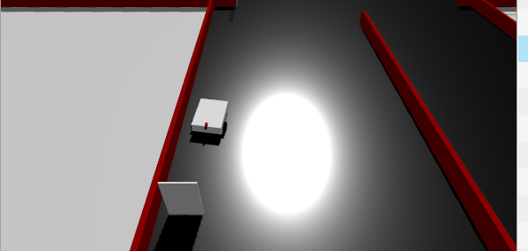

# DIFFDRIVE ARUCO DOCKING

ROS 2 simulation project for an autonomous differential-drive robot. The robot follows a white track, uses lidar for simple obstacle avoidance, detects ArUco markers, and docks automatically at the target station.

## Features

- Gazebo Sim world with a differential-drive robot.
- Camera and 2D lidar sensors.
- `ros2_control` differential-drive controller.
- White-track detection from the camera image.
- ArUco marker detection with OpenCV.
- Kalman filter for smoothing marker pose.
- PD controller for docking motion.
- RViz and `/camera/image_debug` visualization.

## Mission Flow

1. Start Gazebo, spawn the robot, and load controllers.
2. Follow the white track using camera image processing.
3. Avoid close walls or obstacles using lidar sectors.
4. Detect ArUco ID `3` to prepare and turn toward the docking route.
5. Detect ArUco ID `23` at the docking station.
6. Estimate and filter the marker pose, generate a waypoint, then dock.
7. Stop after docking is complete.

## Demo

[](https://drive.google.com/file/d/12-GjgP0ez5qo0zRl9rY7XmKbH43HOQkx/view?usp=sharing)

## Repository Structure

```text
.
+-- README.md
`-- workspace/src
    |-- robot_controller
    |   |-- launch/run.launch.py
    |   `-- robot_controller
    |       |-- aruco_detector.py
    |       |-- control_docking.py
    |       |-- kalman_filter.py
    |       |-- pd_controller.py
    |       `-- utils.py
    `-- robot_scene
        |-- config
        |   |-- config.rviz
        |   |-- diff_control.yaml
        |   `-- ros_gz_bridge.yaml
        |-- launch/bringup.launch.py
        |-- models
        |-- urdf
        `-- worlds/map.sdf
```

## Packages

`robot_scene`

- Robot Xacro/URDF model.
- Gazebo world and models.
- ROS-Gazebo bridge configuration.
- Diff-drive controller configuration.
- RViz configuration.

`robot_controller`

- Main autonomous controller node.
- Camera, lidar, and ArUco processing.
- Kalman filter and PD docking control.
- Full-system launch file.

## Requirements

Recommended environment:

- Ubuntu with ROS 2.
- Gazebo Sim compatible with your ROS 2 distribution.
- Python 3 and `colcon`.
- OpenCV with ArUco support.

Common packages:

```bash
sudo apt install \
  ros-${ROS_DISTRO}-ros-gz-sim \
  ros-${ROS_DISTRO}-ros-gz-bridge \
  ros-${ROS_DISTRO}-robot-state-publisher \
  ros-${ROS_DISTRO}-xacro \
  ros-${ROS_DISTRO}-rviz2 \
  ros-${ROS_DISTRO}-ros2-control \
  ros-${ROS_DISTRO}-ros2-controllers \
  ros-${ROS_DISTRO}-gz-ros2-control \
  ros-${ROS_DISTRO}-cv-bridge \
  ros-${ROS_DISTRO}-rqt-image-view
```

Package names can differ slightly between ROS 2 distributions.

## Build

From the repository root:

```bash
cd workspace
colcon build --symlink-install
source install/setup.bash
```

For every new terminal:

```bash
source /opt/ros/${ROS_DISTRO}/setup.bash
cd workspace
source install/setup.bash
```

## Run

Start the full simulation and autonomous docking controller:

```bash
cd workspace
source install/setup.bash
ros2 launch robot_controller run.launch.py
```

This launch starts Gazebo, robot spawn, robot state publisher, bridge, controllers, RViz, `rqt_image_view`, and the docking controller.

Start only the simulation scene:

```bash
cd workspace
source install/setup.bash
ros2 launch robot_scene bringup.launch.py
```

Use this when checking the robot model, world, sensors, bridge, controllers, or RViz setup without autonomous control.

## Important Topics

| Topic | Type | Description |
|---|---|---|
| `/camera/image_raw` | `sensor_msgs/msg/Image` | Camera image from Gazebo |
| `/camera/camera_info` | `sensor_msgs/msg/CameraInfo` | Camera calibration info |
| `/camera/image_debug` | `sensor_msgs/msg/Image` | Processed image with marker overlay |
| `/diff_drive/scan` | `sensor_msgs/msg/LaserScan` | Lidar scan |
| `/diff_drive_controller/cmd_vel` | `geometry_msgs/msg/TwistStamped` | Velocity command |
| `/tf`, `/tf_static` | `tf2_msgs/msg/TFMessage` | Robot and marker transforms |

## ArUco Markers

| Marker ID | Purpose |
|---:|---|
| `3` | Triggers the turn toward the docking route |
| `23` | Docking station marker |

During docking, the controller broadcasts filtered marker and waypoint frames:

- `filter_aruco_link`
- `aruco_waypoint1`

## Useful Commands

List topics:

```bash
ros2 topic list
```

Check controllers:

```bash
ros2 control list_controllers
```

Check camera or lidar:

```bash
ros2 topic echo /camera/camera_info --once
ros2 topic echo /diff_drive/scan --once
```

View the debug image:

```bash
rqt_image_view
```

Then select:

```text
/camera/image_debug
```

## Troubleshooting

If the robot does not move, check that both controllers are active:

```text
joint_state_broadcaster active
diff_drive_controller active
```

If there is no camera or lidar data, check the bridge topics:

```bash
ros2 topic list
```

If ArUco markers are not detected, open `/camera/image_debug` and verify that the marker is visible and large enough in the camera image.

If Gazebo cannot find models, rebuild and source the workspace:

```bash
cd workspace
colcon build --symlink-install
source install/setup.bash
```

## Author

Maintainer: `quanmh25`

Email: `maihoangquan250205@gmail.com`
